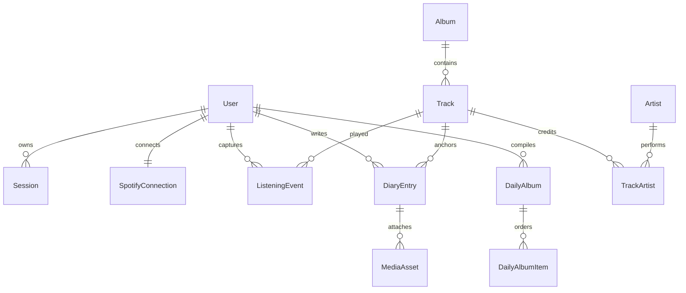

# DB 스키마

주요 ID는 UUID, 시간은 UTC로 저장한다. `User + albumDate`, provider ID, listening dedupe key에 unique 제약을 둔다. 사용자 소유 데이터는 계정 삭제 시 cascade되며, 공유 메타데이터 Track/Artist/Album은 의도치 않은 삭제를 막기 위해 restrict/set-null을 사용한다.
