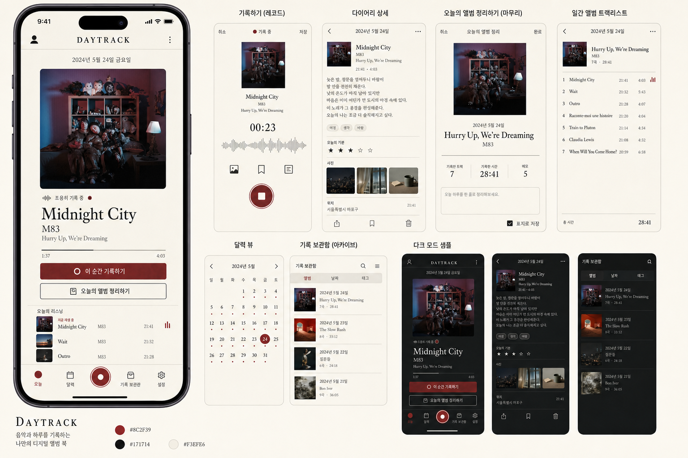

# DAYTRACK 디자인 명세

## 선택한 방향

독립 음악 잡지와 LP 라이너 노트의 편집 디자인을 개인 일기장에 결합한다. 밝은 종이 `#F3EFE6`, 먹색 `#171714`, 옥스블러드 `#8C2F39`를 핵심 토큰으로 사용한다. 앨범 표지는 온전한 정사각형으로 가장 큰 시각 요소가 되며, 텍스트나 로고를 덮지 않는다.

## 구성 원칙

- 모바일 우선 390×844, 430×932; 데스크톱 1440×900.
- 제목은 세리프, UI와 본문은 한국어 산세리프, 시간은 고정폭 글꼴을 사용한다.
- 중첩 카드 대신 선, 여백, 타임라인으로 정보를 나눈다.
- 하단 기록 버튼만 원형으로 강조한다.
- 다크 모드는 종이와 먹색을 반전하고 같은 계층과 대비를 유지한다.
- 모션은 상태 변화에만 사용하며 `prefers-reduced-motion`을 준수한다.
